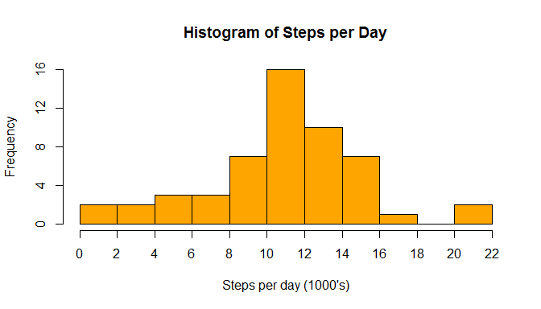
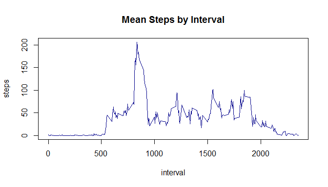
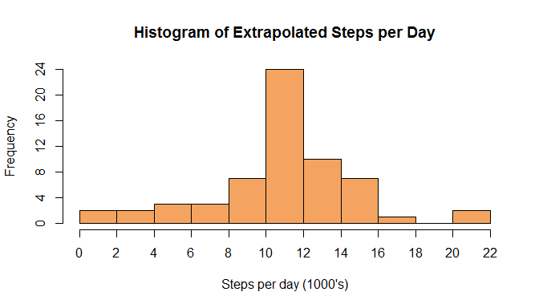
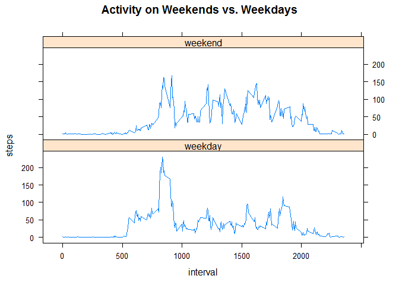

# Reproducible Research: Peer Assessment 1


## Loading and preprocessing the data

```r
# Unzip the source file
act.zipfile.name <- "./activity.zip"
act.csvfile.name <- "./activity.csv"
if(!file.exists(act.csvfile.name)){
        unzip(act.zipfile.name)
}
# read csv file into data table
activity.original <- read.csv(act.csvfile.name)
```

## What is mean total number of steps taken per day?

```r
# aggregate the data by day
act.by.date.orig <- aggregate(steps ~ date, data = activity.original, 
                              FUN = sum)
summ.by.date.orig <- summary(act.by.date.orig$steps)
# extract and format requested statistics
disp.mean <- format(summ.by.date.orig[["Mean"]], scientific = FALSE)
disp.median <- format(summ.by.date.orig[["Median"]], scientific = FALSE)
# display the summary information
summ.by.date.orig
```

```
##    Min. 1st Qu.  Median    Mean 3rd Qu.    Max. 
##      41    8841   10765   10766   13294   21194
```

As can be seen above, the mean number of steps taken is **10766.19** 
and the median is **10765**.


```r
# Store histogram info for axis formatting
disp.hist.info <- hist(act.by.date.orig$steps, breaks = "FD", plot = FALSE)
# Histogram of total steps per day
hist(act.by.date.orig$steps, breaks = "FD", col = "orange", 
     xlab = "Steps per day (1000's)", main = "Histogram of Steps per Day",
     axes = FALSE)
axis(side = 1, at = disp.hist.info$breaks,
     labels = (disp.hist.info$breaks/1000))
axis( side = 2, at = seq(0,max(disp.hist.info$counts), by = 4))
```

<!-- -->

## What is the average daily activity pattern?

```r
# aggregate the data by interval
act.by.interval.orig <- aggregate(steps ~ interval, data = activity.original, 
                              FUN = mean)
busy.interval <- act.by.interval.orig[
        act.by.interval.orig$steps == max(act.by.interval.orig$steps),
        ]
disp.int.name <- as.character(busy.interval$interval)
disp.int.steps <- format(busy.interval$steps, scientific = FALSE)
plot(act.by.interval.orig, type = "l", col = "dark blue",
     main = "Mean Steps by Interval")
```

<!-- -->

The busiest interval is **835** with on average 
**206.1698** steps.

## Imputing missing values

```r
# take a copy of the original data for further processing
num.nas <- sum(is.na(activity.original$steps))
```

Number of NA records in the dataset is **2304**.


```r
activity.imputed <- activity.original
# use the mean for a given interval to extrapolate missing values
activity.imputed$steps <- replace(activity.imputed$steps, 
                                  is.na(activity.imputed$steps),
                                  act.by.interval.orig$steps)
# aggregate the data by day
act.by.date.imp <- aggregate(steps ~ date, data = activity.imputed, 
                              FUN = sum)
summ.by.date.imp <- summary(act.by.date.imp$steps)
# extract and format requested statistics
disp.mean <- format(summ.by.date.imp[["Mean"]], scientific = FALSE)
disp.median <- format(summ.by.date.imp[["Median"]], scientific = FALSE)
# display the summary information
summ.by.date.imp
```

```
##    Min. 1st Qu.  Median    Mean 3rd Qu.    Max. 
##      41    9819   10766   10766   12811   21194
```

As can be seen above, with the extrapolated data the mean number of steps 
taken is **10766.19** and the median is **10766.19**.


```r
# Store histogram info for axis formatting
disp.hist.info <- hist(act.by.date.imp$steps, breaks = "FD", plot = FALSE)
# Histogram of total steps per day
hist(act.by.date.imp$steps, breaks = "FD", col = "sandybrown", 
     xlab = "Steps per day (1000's)", 
     main = "Histogram of Extrapolated Steps per Day",
     axes = FALSE)
axis(side = 1, at = disp.hist.info$breaks,
     labels = (disp.hist.info$breaks/1000))
axis( side = 2, at = seq(0,max(disp.hist.info$counts), by = 4))
```

<!-- -->

Extrapolating the data in this way has not materially changed the pattern of
data but has increased some of the raw figures.  
Extrapolation may lead to some confirmation bias (missing information will
tend to reinforce existing patterns) and will tend to ignore or miss the impact 
of unique events e.g. in the UK the 5 minute interval between 1100 and 1105 on 
November 11th is likely to be a period of lower activity due to Armistice 
Remembrance.  
Better extrapolation may take into account the day of the week as well as the
interval to reduce the likelihood of weekday patterns being extrapolated to
weekends.

## Are there differences in activity patterns between weekdays and weekends?

```r
# function that returns true if a given date is a weekday
is.weekday <- function(x){
        w <- as.Date(x)
        w <- weekdays(w)
        if (w == "Saturday" || w == "Sunday")
                FALSE
        else
                TRUE
}
activity.imputed["dayofweek"] <- weekdays(as.Date(activity.imputed$date))
bool.weekday <- sapply(activity.imputed$date, is.weekday)
# create a factor based on whether the day is a weekend
activity.imputed["weekday"] <- factor(as.numeric(bool.weekday), 
                                      levels = c(1,0), 
                                      labels = c("weekday", "weekend"))
# aggregate the data by interval and type of day
act.by.interval.imp <- aggregate(steps ~ interval + weekday, 
        data = activity.imputed, 
        FUN = mean)
# Create a panel plot of the data
library("lattice")
xyplot(steps ~ interval | weekday, 
       data = act.by.interval.imp, type = "l", layout = c(1,2), 
       main = "Activity on Weekends vs. Weekdays")
```

<!-- -->

